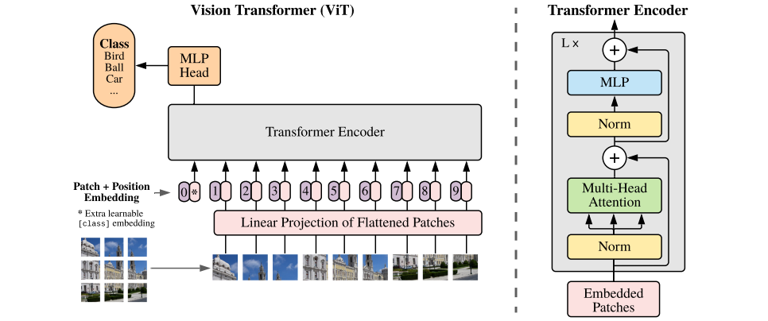
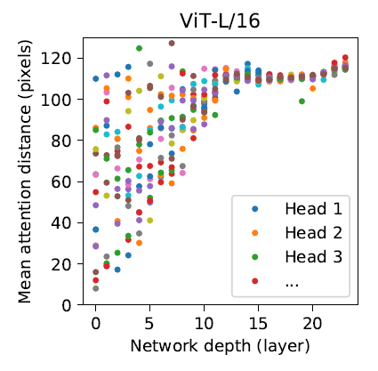
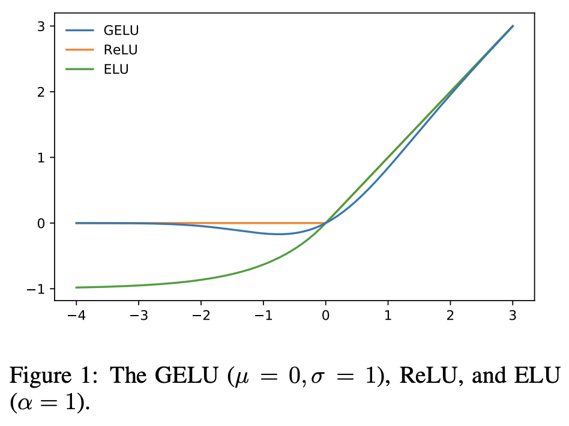

# pytorch-tutorial-ViT

This repo aims to reproduce the code from [paper](https://arxiv.org/abs/2010.11929). During this tutorial you will learn:
1. the details about **transformer** ([paper](https://arxiv.org/abs/1706.03762))
2. the details about **vision transformer**
3. how to fine-tune ViT by using **torchvision** and **HF transformers**   
4. how to use [**ignite**](https://pytorch-ignite.ai/) to train and evaluate the model


## 0. Environment setup:

Use conda to create the virtual env, all the python packages are explicitly stored within.

Open conda prompt and type the following command:
```
conda create --name myenv --file requirements_torch_monai_env.txt
```

## 1. Prepare dataset
In this tutorial, we choose to use two very simple classification dataset -- hymenoptera dataset, the download link is [here](https://download.pytorch.org/tutorial/hymenoptera_data.zip) and kaggle dog tiny dataset, link is [here](https://www.kaggle.com/c/dog-breed-identification). But first, we only use hymenoptera (because it is so simple)

In this simple classiciation task, there are two classes: ants and bees. If you are not familiar with pytorch dataset and dataloader, please check [official pytorch info](https://pytorch.org/tutorials/beginner/basics/data_tutorial.html), or *tutorials/basic_pytorch_tutorials/check_different_datasets.ipynb*

Dataset is used to transform the data path into data (tensor). And dataloader is to batchize the dataset samples into a pre-determined batch size and feed to the neural network. Please check *Dataset.py*

**IMPORTANT:** if you want to use a different dataset, be sure to prepare the data with three different features:
1. the dataloaders -- a dict with 'train' and 'val' as keys
2. class_names -- a list includes all the class names with orders
3. dataset_size -- a dict with 'train' and 'val' as keys

## 2. ViT model reproduction
This is the main topic for this tutorial, please check *vit_model_reproduce.py*.

Firstly, let's have a look at the model structure.

<p align="center">

</p>

([image ref](https://arxiv.org/abs/2010.11929))

A very clear model structure can be seen here, let's focus on these key elements:
1. **Patch**, divide one image into small patches
2. **Position embedding**, a common thing for transformer based model, to learn the location of each patch
3. **Transformer encoder**, the details are shown in the right side, two key things:
    * **Multi-Head Attention**
    * **MLP**, a combination of dropout, linear layer and activation function -- GeLU
    * **Norm**, always LayerNorm
4. **MLP head**, a classification head

### 2.0 The data flow of vision transformer  
(B = batch size, 3 = # of RGB channels, H, W = Height, width, $n_p$ = # of patches, D(or d) = # of hiddens)

0. input images with shape **[B, 3, H, W]**
1. devide each image into small patches *class PatchEmbedding*, embedded patches with shape **[B, $n_p$, d]**
2. concat a *cls_token* to the embedded patches, the shape will be **[B, $n_p$+1, d]**
3. add (not concat) *position_embedding* to it **[B, $n_p$+1, d]**
4. feed the embedded patches to the transformer encoder (several blocks of *class ViTBlock*), the output shape after each transformer layers stays the same **[B, $n_p$+1, d]**
5. take the features (X -> [B, $n_p$+1, d]) related to class token **X[:, 0, :]**, get output as shape **[B, 1, d] = [B, d]**
6. feed into *MLP_head* **[B, # of class]**

### 2.1 PatchEmbedding
Check *class PatchEmbedding* in *vit_model_reproduce.py*, and test the complete code in *test_vit.ipynb*. (P = patch size)

In this part, the original paper, they said:
>The Transformer uses constant latent vector size D through all of its layers, so we
flatten the patches and map to D dimensions with a trainable linear projection.

There are two steps here:
1. (create all the patches), and then flatten all the patches (treat each patch as a token in NLP)
2. linear project to $D$ dimensions

But mathmatically, these two steps can be done by a simple 2D convolution operation. By using 
~~~
nn.Conv2d(in_channels = 3, out_channels = D, kernel_size = (P, P), stride = P, padding = 0)
~~~
But why they are equivalent? Let's prove it!
* Firstly we will see how the patch works. let's assume the input image is $X \in \mathbb{R}^{3 \times H \times W}$. By creating $P \times P$ patches, $X$ is reshaped as $X \in \mathbb{R}^{3 \times (\frac{H}{P} \times P) \times (\frac{W}{P} \times P)}$, and further into $X \in \mathbb{R}^{(\frac{H}{P} \times \frac{W}{P}) \times (P \times P \times 3)}$. Since the number of patches is $n_{p} = \frac{H}{P} \times \frac{W}{P}$, the whole thing can be simplified as $X \in \mathbb{R}^{n_{p} \times (P \times P \times 3)}$. After flatten each patches, assume that $D_{patch} = P \times P \times 3$, we have a tensor $X_{flatten} \in \mathbb{R}^{n_{p} \times D_{patch}}$
* Next, let's see how linear project works. By using a linear layer that maps $D_{patch}$ dimension to $D$ dimension, the weight should be $W_{linear} \in \mathbb{R}^{D_{patch} \times D}$. So by using matrix multiplication $X_{flatten} \times W_{linear} \in \mathbb{R}^{n_{p} \times D_{patch}} \times \mathbb{R}^{D_{patch} \times D} = \mathbb{R}^{n_{p} \times D}$, and here we get the embedded $n_{p}$ patches with feature $D$. 

By changing the order of tensor operation slightly, we can achieve the same thing in a different way. 
* Firstly, remember that $W_{linear} \in  \mathbb{R}^{D_{patch} \times D}$, this can be reformed as a tensor $ W_{linear} = W_{reform} \in \mathbb{R}^{(P \times P \times 3) \times D} = \mathbb{R}^{3 \times D \times (P \times P)}$. Does this look familiar to you? **This is a 2D convolution layer with input channel = 3, output channel = D, and kernel size = (P, P)** 
* So the input image has shape $X \in \mathbb{R}^{3 \times H \times W}$, but reshaping it into $X_{conv} \in \mathbb{R}^{(\frac{H}{P} \times \frac{W}{P}) \times (P \times P \times 3)}$. By tensor multiplication between $X_{conv}$ and $W_{reform}$, the result stays the same.
$$X_{conv} \times W_{reform} \in  \mathbb{R}^{n_p \times (P \times P \times 3)} \times \mathbb{R}^{(P \times P \times 3) \times D} = \mathbb{R}^{n_p \times D}$$

### 2.2 Position embedding
There are a lot of different methods to embed the position, but here, we simple use the most straightforward one, random value that can be learnt during the training. For each token($n_p$ patches, and one class token), we create random series to add into the patch embedding. Be careful, here we use add, not concat.

More details [here](https://jaketae.github.io/study/relative-positional-encoding/).

### 2.3 Transformer Encoder
In this section, we will start with answering 
1. what is scaled dot-product attention, 
2. what is multi-head attention,
3. what does MLP look like,
4. why using layernorm.

#### 2.3.1 What is scaled dot-product attention
Check *class ScaledDotProductAttention* in *vit_model_reproduce.py*. 

In general, you need to have three matrix: key [n,d], query [m,d], and value [m,v]. 

* key and query con be treated as a key, lock pair. So assuming if you have n different keys with m different locks, we want to know which key is paired with which lock (query). How we can decide if key and lock is a match? We use dot-product. For any one key and one lock, there is a [d,] vector, by dot-product, we will output just a single value, a value reach its max when key and query are in the same direction, and reach its min when the key and query are in opposite direction. For example, $k = [0.5, 0.5], q1 = [1, 1], q2 = [1,-1], q3 = [-1,-1]$, the dot-product between k and q1 is the biggest (because they are towards the same direction 45 degree rotated from X-axis); the dot-product between k and q2, the value is 0, because they are perpendicular, but that's not the worst; the dot-product between k and q3 is negative, which is the smallest, (because they are in the opposite direction).

The formula for self-attention is in appendix A equation (5-7).

#### 2.3.2 what is multi-head attention
check *class MultiHeadAttention* in *vit_model_reproduce.py*

Always remember that multi-head attention did not change the shape of tensor! And the number of heads needs to be divided by feature number! 

In general, multi-head is a way to let the attention mechanism works with multiply channels, each channel can pay attention to different features or patterns. Just like convolution can learn different filters to detect edges, multi-head attention can do the same, but better (because there is no locality as pre-knowledge). From the figure below, there are three key points:
1. attention has no locality, this means even at the shallow layer of neural network, two distant region are pay attnetion with each other.
2. convolution has inductive bias and locality. This is why convolution can only learn global features at the deep layers of neural network.
3. each head pay attention to different dstance region at the very begining, therefore no need to have a lot of heads if the image is not super big, somewhere between 5-10 would be enough.

<p align="center">

</p>

([image ref](https://arxiv.org/abs/2010.11929))

The detail math formula can be found in appendix A equation (8). 


#### 2.3.3 what does MLP look like
check *class ViTMLP* in *vit_model_reproduce.py*
From paper, the authers only said this:
> The MLP contains two layers with a GELU non-linearity.

By checking some details in the original code, the ViT MLP is:
~~~
X = linear_layer(x)
x = gelu_activation(x)
x = dropout(x)
x = linear_layer(x)
x = dropout(x)
~~~  

So what is the difference between GeLU and ReLU and ELU?
<p align="center">

</p>

([image ref](https://arxiv.org/abs/1606.08415v5))

Well, in this figure, you can see quite clear. ReLU is non-differentiate at origin, but GeLU is. ELU start from -1(when x is negative infinite) and become linear after passing origin. The curvature can be controlled by the hyperparamaters.


#### 2.3.4 why using layernorm
I find this [post](https://stats.stackexchange.com/questions/474440/why-do-transformers-use-layer-norm-instead-of-batch-norm) is quite useful, here is the quote:
> in batchnorm, the mean and variance statistics used for normalization are calculated across all elements of all instances in a batch, for each feature independently.

>  for layernorm, the statistics are calculated across the feature dimension, for each element and instance independently.

Layernorm is very suitable for NLP transformer models because each sentence could have different length, so the calculation on feature dimension is more than proper. 

But personally, batchnorm is unfit for NLP, but not for CV. So you are free to try to use batchnorm instead of layernorm here, but since the origin paper uses layernorm, we will continue this way.

### 2.4 MLP head
check *class ViT* in *vit_model_reproduce.py*.

**IMPORTANT:** this MLP head is only work on *cls token* for classification, the orange block in the first figure.

When the data flow through the transformer encoder, the output (X) shape is **[B, $n_p$ + 1, d]**, where B is batch size, d is feature, and $n_p$ is the number of patches, **1** represents *cls token*. We only take the part belongs to *cls token* for classification, **$X[:,0] \in \mathbb{R}^{B \times d}$**. 

So the structure of this MLP head is:
~~~
x = X[:,0]
x = layernorm(x)
x = linear_layer(x)
~~~
Where the linear layer is a projection layer mapping d into number of classes. In the original paper, the dataset is imagenet, which has 1000 classes, but in our case, we only have 2 classes ('ants', 'bees')

### 2.5 Models
check *def ViT_reproduce_t_16* and *def ViT_b_16* in *Model.py*.

* *ViT_reproduce_t_16* is the function only using the cde from *vit_model_reproduce.py*
* *ViT_b_16* uses the build-in function from torchvision. This is the function that can be used as fune-tuning.


## 3. training
check *train_classification_model* and *train_classification_model_ignite* in *Trainer.py*

Inside you can find two different training functions for training the model, 
* *train_classification_model* uses vanilla pytorch training loop
* *train_classification_model_ignite* uses ignite for training, it includes a better logger which can be visualized in tensorboard.

For training the models that mentioned here
~~~
$ python main.py
~~~

## 4. Inference
check *def visualize_model* in *Utils.py*

This function can visualize the first batch of validation data.

## 5. Conclusion
check *main.py*

The goal of this tutorial is to have a deeper understanding on vision transformer. Nowadays, developers are focusing on applying the SOTA models on their customized dataset, which makes sense because why reinvent the wheel? But it is different for researchers in deep learning field. For deep learning with computer vision, ViT is a build-in model in many open source framework, like pytorch, tensorflow. Many cool models use ViT as backbone for different computer vision tasks. Of course, eventually, we all use torchvision.models.vit, but how many people really understand every detail of ViT? If you do not understand how does ViT really works, then how can you make innovation upon it?


